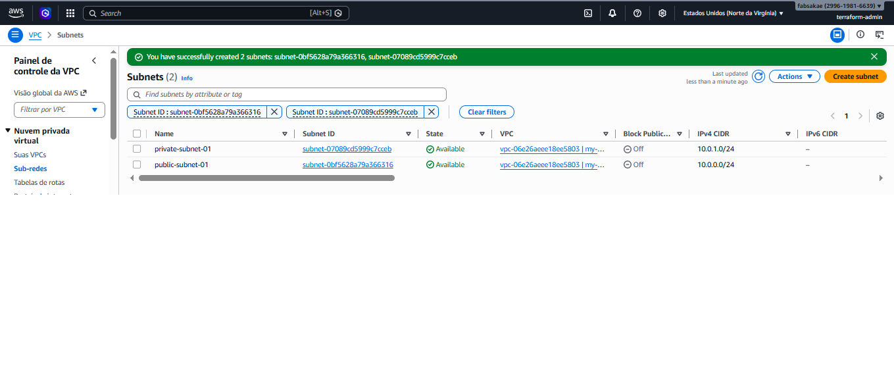
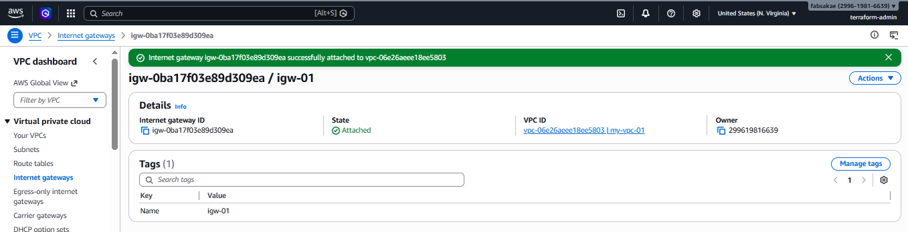
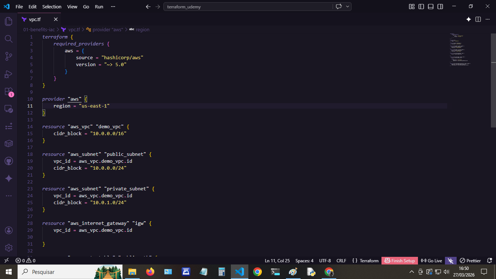
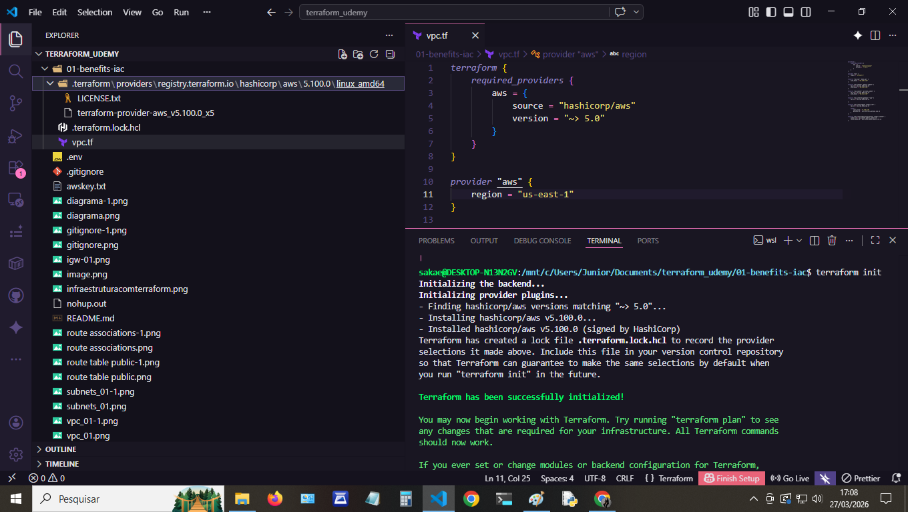
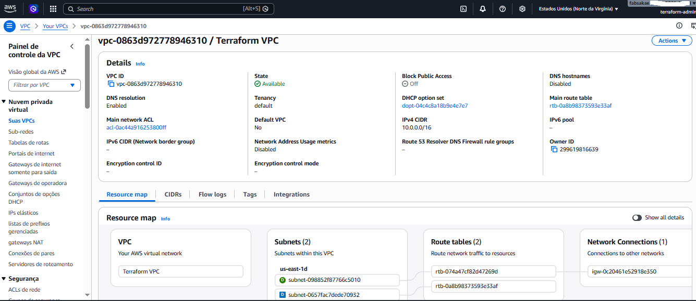

# ☁️ Estudos de Infraestrutura como Código com Terraform e AWS


## 📖 Sobre o Projeto
Este repositório documenta minha jornada de aprendizado prático em **Infraestrutura como Código (IaC)** utilizando Terraform na nuvem AWS. O objetivo é construir ambientes escaláveis, aplicando boas práticas de mercado, segurança e controle de custos desde o dia zero.

##  Stack Tecnológica
* **Terraform:** Provisionamento e gerenciamento de infraestrutura.
* **AWS:** Provedor de nuvem (VPC, Subnets, EC2, IAM, etc.).
* **Docker & Minikube:** Ferramentas complementares no meu ambiente local.
* **Git & GitHub:** Versionamento de código e documentação.

##  Arquitetura e Módulos Concluídos
Acompanhamento prático das aulas e implementações:
- [x] **Diagrama inicial:**

[Clique aqui para ver o diagrama detalhado](./image-01-benefits/diagrama.png)


- [x] **Setup e Segurança:** Configuração de repositório blindado (`.gitignore` para `.tfstate` e credenciais).

[Clique aqui para ver a imagem](./image-01-benefits\gitignore.png)

- [x] **FinOps Básico:** Criação de *AWS Zero-Spend Budget* para evitar cobranças indesejadas.

- [x] **Networking 01:** Criação de VPC, Subnets Públicas e Privadas, Internet Gateway, Route Tables de forma Manual.

* Criação da VPC (10.0.0.0/16)


* Criação das subnets Públicas e Privadas.


* Criação do Internet Gateway associado a VPC.


* Criação de uma Route Table que controla o roteamento da subnet para tornar a subnet pública com uma entrada para o IGW.


* Associação de subnet


- [x] **Networking 02:** Criação de VPC, Subnets Públicas e Privadas, Internet Gateway usando Terraform e IaC.


* Inicializando o Terraform


* Após os comandos:
```
terraform plan
terraform apply
```
* Infraestrutura disponível



##  Comandos de Sobrevivência (Cheatsheet)
Registro dos comandos mais utilizados no fluxo de trabalho:
* `terraform init`: Prepara o terreno baixando os plugins da AWS.
* `terraform plan`: Meu melhor amigo. Mostra o que vai ser alterado/criado antes de executar.
* `terraform apply`: Aplica as mudanças e constrói a infraestrutura.
* `terraform destroy`: O comando de ouro para limpar tudo após os estudos e não estourar o cartão de crédito.

## ⚙️ Como executar localmente
> **Aviso de Custos:** Alguns recursos provisionados podem sair do *AWS Free Tier*. Sempre utilize o comando de destruição após os testes (terraform destroy).

1. Clone o repositório:
   ```bash
   git clone [https://github.com/fabsakae/projeto-terraform-aws.git](https://github.com/fabsakae/projeto-terraform-aws.git)